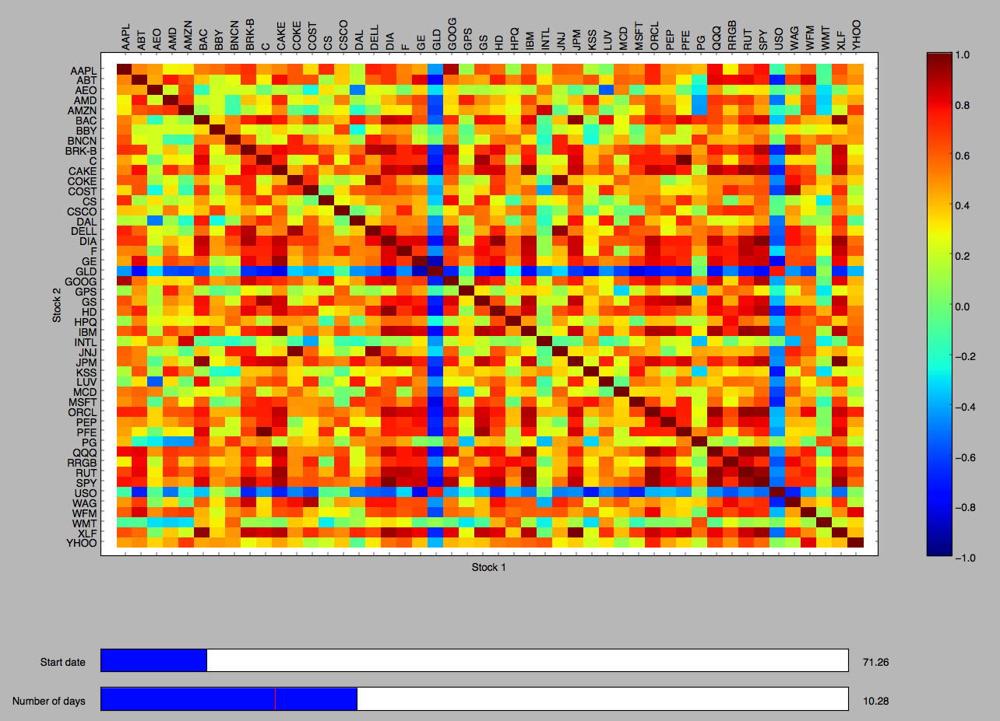

### Heat Map of Stocks

This project creates an interactive heat map between the correlation of stocks. Data for the stocks are from 2010 till 2012, with 48 different stocks. The stocks are located in data/stocks. The adjustable interactive parameters are the start date amd number of days to run the correlation. 

to run the heat map, type in terminal:

	python visualizer.py stock data/stocks

Example of heatmap:

